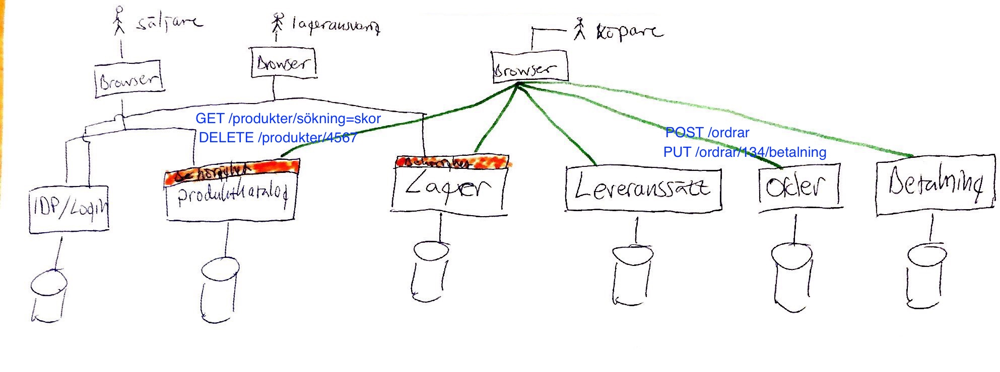

# pvt
Example code, slides, and lists from the pvt-course.

This is an example implementation of one service in the example architecture.
The resulting artifact has an embedded jetty-server and is a self-contained uber-jar that can be started with

    java -jar <target/pvt-2017-0.0.1-SNAPSHOT.jar>

You can also run

    mvn exec:java

to start the webserver.

# Architecture example from slides

